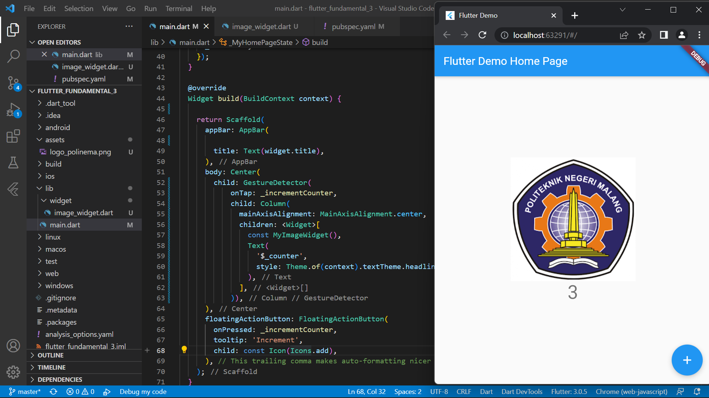
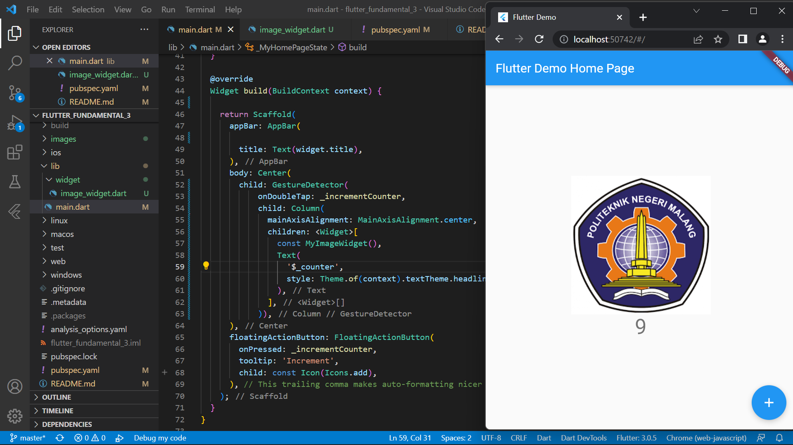
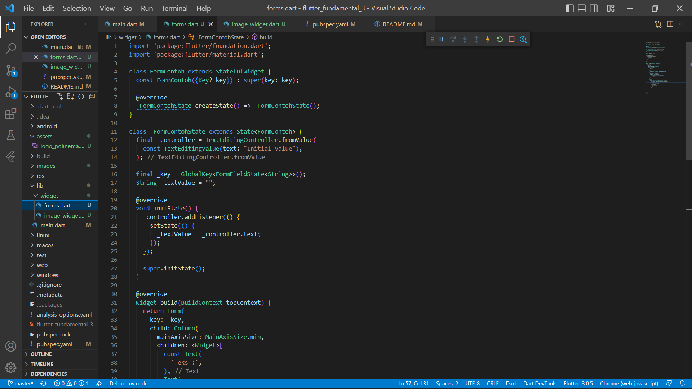
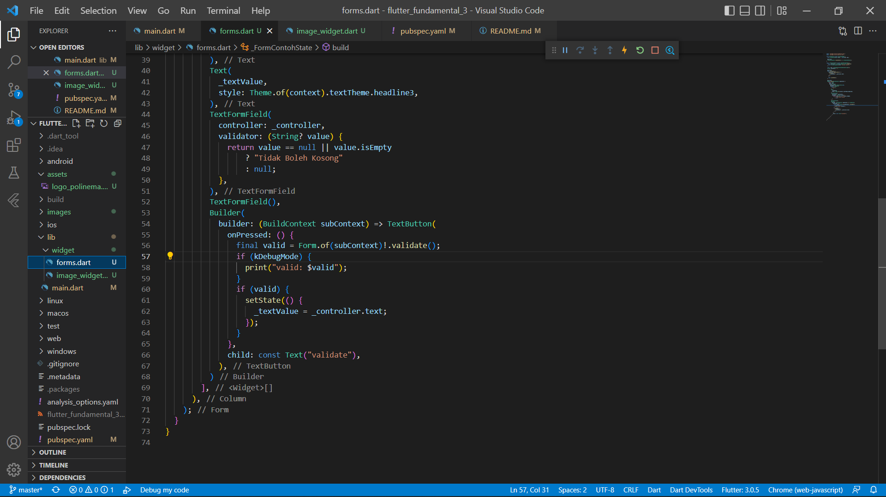
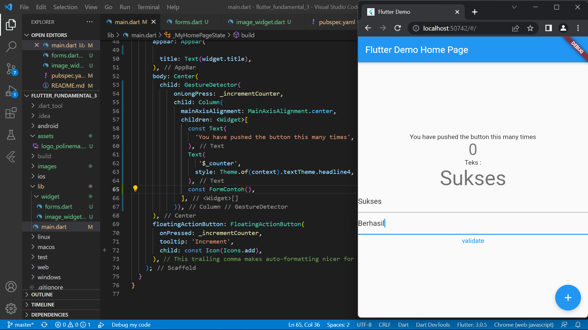
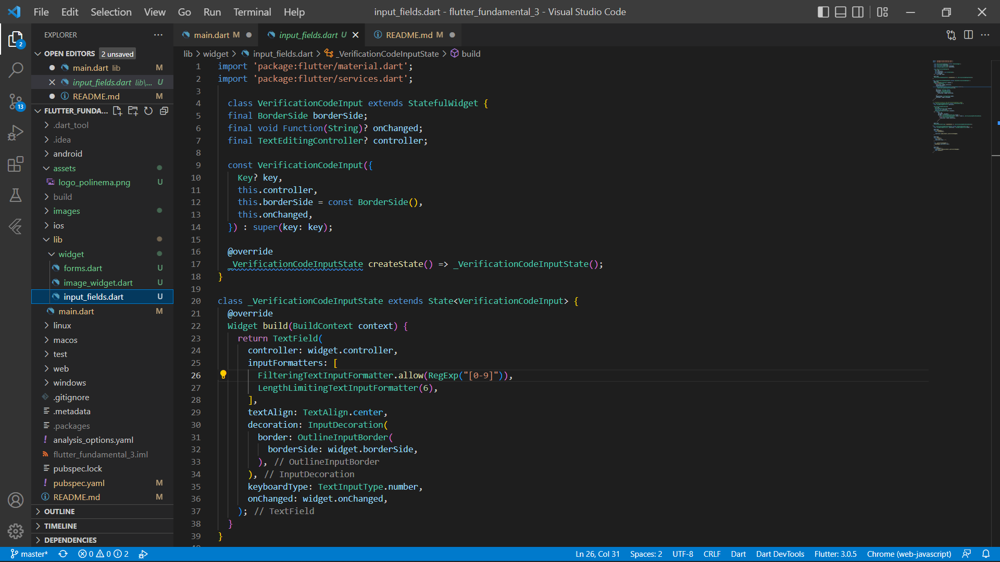
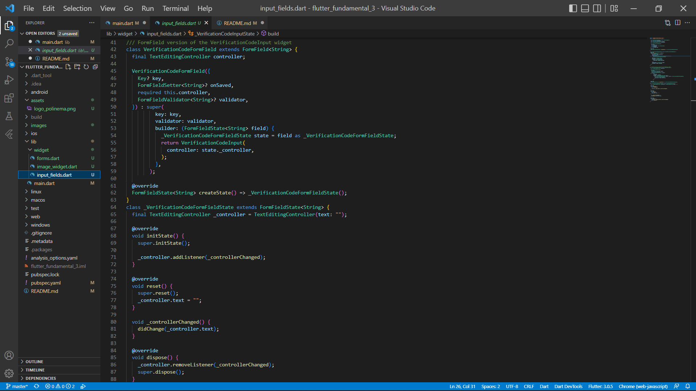
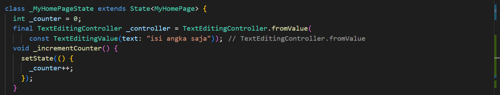
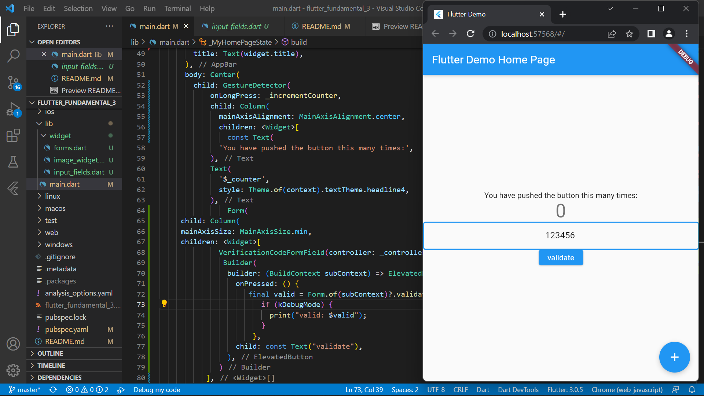
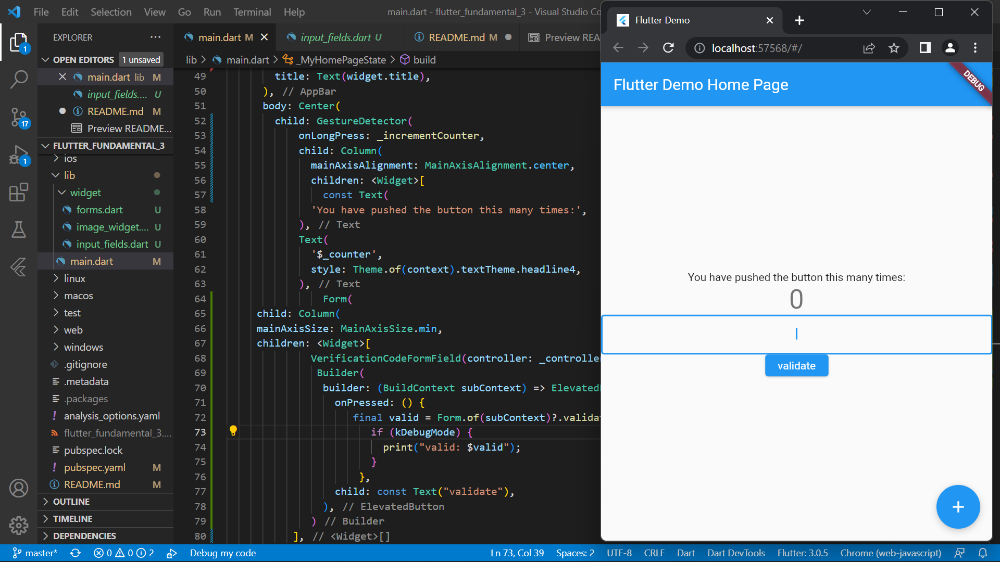

# flutter_fundamental_3

# **Tugas Pertemuan 18**
## **Project flutter_fundamental_3**

### Praktikum 1 : Menerapkan Gesture Detector
* Langkah 1-3

* Langkah 4 Eksperimen Jenis Gesture Lain
Sekarang Anda ganti kode bagian onTap dari Langkah 2 dengan onDoubleTap dan onLongPress. Lalu screenshot masing-masing hasil tampilannya dan jelaskan fungsinya!
- onDoubleTap

dengan mengubah kode menjadi onDoubleTop maka untuk memunculkan angka cukup dengan menklik/tap logo dua kali ketukan.
- onLongPress

dengan mengubah kode menjadi onLongPress maka untuk memunculkan angka cukup dengan menklik/tap logo dengan sedikit ditahan.

### Praktikum 2 : Menerapkan Input Widget dan Forms
* Langkah 1-2 Buat class FormContoh dan class _FormContohState

* Langkah 3: Tambah Widget FormContoh di main.dart

### Praktikum 3 : Menerapkan Custom Input dan FormField Widget
* Langkah 1-4 Buat class VerificationCodeInput, class _VerificationCodeInputState, class VerificationCodeFormField, class _VerificationCodeFormFieldState

* Langkah 5: Tambah variabel _controller

kontrol untuk mengatur input an pada form field, yakni hanya berupa angka saja

* Langkah 6: Tambah Widget VerificationCodeFormField
Lalu masuk ke method Widget build pada bagian children: tambahkan Form seperti kode berikut. Lakukan import dari file input_fields.dart untuk VerificationCodeFormField.

form field hanya dapat diisi dengan angka saja. apabila diisikan dengan huruf. maka tidak ada perubahan pada form field. hal tersebut dikarenakan ada penambahan code TextEditingController _controller, yang mengatur agar pengisian form field hanya dapat dilakukan oleh angka saja

pengisian form field dengan huruf tidak dapat dilakukan. tidak ada hasil yang ditunjukkan.